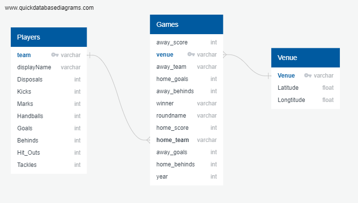

# Australian Football League Teams Analysis

In this project, we aim to provide some insights on the AFL team performance throughout the past nine years (2012 - 2021).

## Team Members  👨🏻‍💻👩🏻‍💻👩🏻‍💻👩🏻‍💻

- [Ishaan Nigam](https://github.com/ishaan04)
- [Nga Phu](https://github.com/nkphu)
- [Samra Vatan Parast](https://github.com/Samravp)
- [Serena Zhao](https://github.com/SerenaZhaoYanqing)

## Datasets
### Please add password for postgresql before running the code in jupyter notebook 
We extracted our data by performing API calls, we used [Squiggle API](https://api.squiggle.com.au/#section_teams). 
The Squiggle API offers public access to raw data about AFL games and predictions made by popular online models.
Query types we used are as per below;
 - Teams query
 - Games query
 - Tips query

## ETL Process

* **Extract**:Datasets were extracted using [Squiggle API](https://api.squiggle.com.au/#section_teams) calls.

* **Transform**: Using Jupyter Notebook and pandas, we cleaned and reorganised the data according to our needs.

* **Load**: Considering the normalised and relational structure of our data, PostgreSQL was our database of choice.

## Data Engineering - Architecture Diagram

We created our table schemas and configured primary key and foreign keys to create relationships between our tables.

The tool we used is this step was [Quick Database Diagrams (QuickDBD)](https://www.quickdatabasediagrams.com/)

## Data Visualisation

We draw insights from our data using JavaScript and HTML.

Libraries we used are as follows;

 - D3.js: D3 is a JavaScript library for manipulating documents based on data.
 - AnyChart: AnyChart is a lightweight and robust JavaScript charting library.

## Final Dashboard

 
